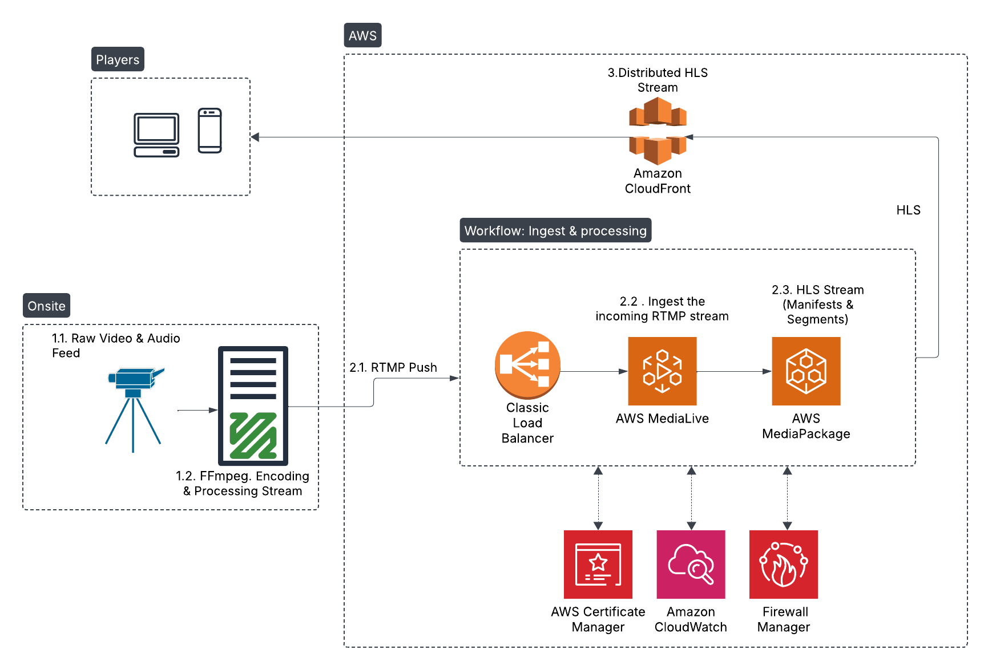

### **Live Streaming Workflow: Camera to HLS Playback**  
  

- Onsite Components: Cameras, encoders.
- AWS Ingest & Processing: MediaLive for transcoding and MediaPackage for packaging.
- CDN: CloudFront distribution.
- Security & Monitoring: Firewalls, encryption, and CloudWatch.
- Playback: End-user HLS players.

#### **1. Onsite Components**  
- **1.1 Raw Feed**: Cameras capture uncompressed video/audio (e.g., SDI/HDMI).  
- **1.2 Encoding**: RTMP stream created via encoders (e.g., FFmpeg, OBS) using H.264/H.265.  

#### **2. AWS Ingest & Processing**  
- **2.1 RTMP Push**: Secure SSL/TLS push to AWS MediaLive.  
- **2.2 MediaLive**: Transcodes RTMP into multi-bitrate HLS/DASH streams.  
- **2.3 MediaPackage**: Packages streams into HLS segments + manifests, adds DRM/ads.  
#### **3 CloudFront CDN**: 
- Distributes HLS globally with low latency + DDoS protection.  

#### **Security**  
- **Firewall Manager**: Blocks malicious traffic to AWS endpoints.  
- **Encryption**: SSL/TLS (RTMP), HTTPS (HLS), optional AES-128/256.  

#### **Monitoring**  
- **CloudWatch**: Tracks stream health, latency, errors, and triggers alarms.  

#### **Playback**  
- **HLS Players**: JW Player, Video.js, or native apps with token auth (Cognito).  

#### **Enhancements**  
- **S3 Bucket**: Stores VoD recordings.  
- **Redundancy**: Multi-region failover, dual RTMP endpoints.  

---

### **End-to-End Flow**  
Camera → Encoder (RTMP) → MediaLive → MediaPackage → CloudFront → Players.  
